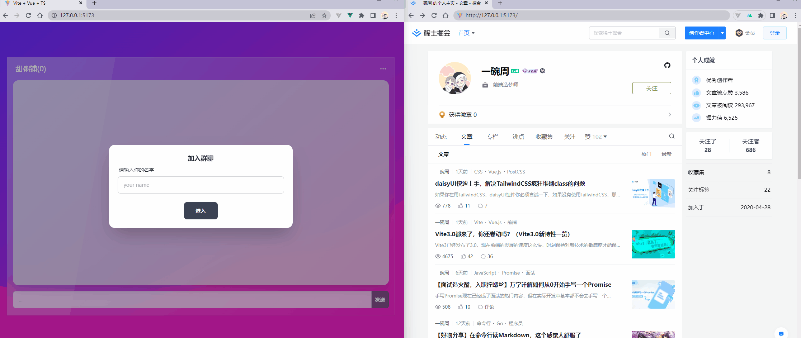
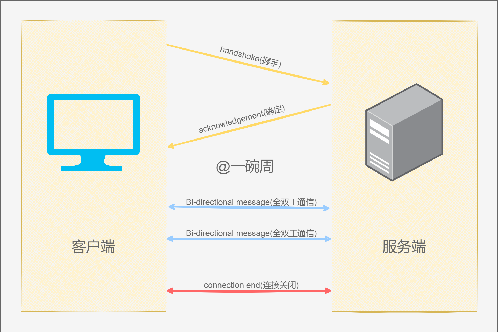
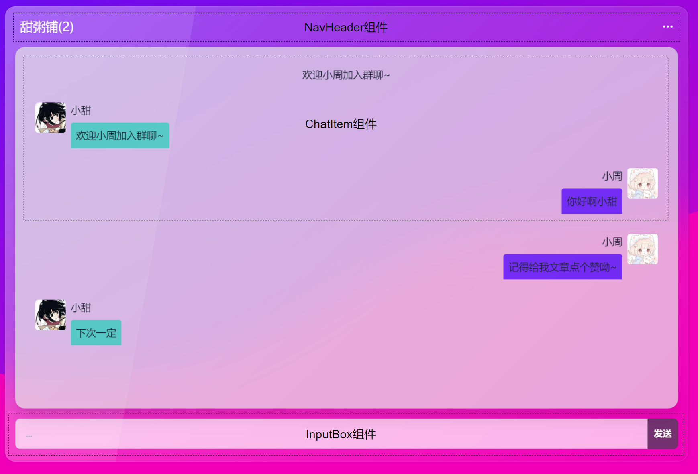
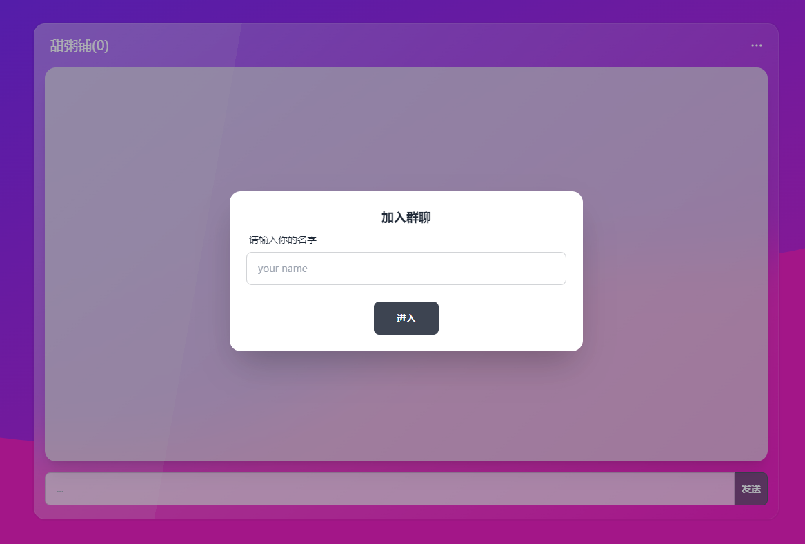

# Vue3+Node实现一个WebSocket即时通讯聊天室

## 🍐 写在前面

这篇文章主要是用WebSocket技术实现一个**即时通讯聊天室**，首先先要了解为什么使用WebSocket而不是普通的HTTP协议，如果使用HTTP协议它是下面这种情况：

*   我发送一条消息，发送一个发送消息的请求；

*   一直轮询接收别人发送的消息，不管有没有发送都要定时去调用接口。

这里明显有**资源的浪费**，因为我们不管有没有数据都要定时的去调用接收消息的接口。

这个就可以通过WebSocket去解决，**本篇文章包括的内容如下**：

*   简单说一下WebSocket

*   使用daisyUI+Vue3搭建页面

*   socket通信demo

*   实现即时通讯聊天室

最终实现效果如下：



### 🍍 技术栈

项目的源代码在[Github](https://github.com/ywanzhou/socket-demo "Github")中，项目采用pnpm+Monorepo的方式搭建，如何搭建一个Monorepo项目可以参考[从0开始使用pnpm构建一个Monorepo方式管理的demo ](https://juejin.cn/post/7115058575801581605 "从0开始使用pnpm构建一个Monorepo方式管理的demo ")。

文本所用到的技术如下：

服务端：

*   socket.io\@4.15.1


*   nodemon\@2

客户端


*   vue\@3.2


*   vite\@3.0


*   tailwindcss\@3.1.6


*   daisyui\@2.19（关于这个UI组件库可以参考[daisyUI快速上手，解决TailwindCSS疯狂堆砌class的问题](https://juejin.cn/post/7121355067357298696 "daisyUI快速上手，解决TailwindCSS疯狂堆砌class的问题")）

## 🍏 什么是WebSocket

WebSocket是另一种网络协议，但没有完全脱离HTTP，**握手阶段采用的就是HTTP协议**，这么做的好处就是**不易被屏蔽，能通过各种HTTP代理服务器**；

WebSocket最大的特点就是**服务器可以主动向客户端推送消息**，当然，**客户端也可以主动的向服务器发送消息**。而普通的HTTP协议只能由客户端向服务器发送，服务器根据内容进行返回。

通信过程如下图：



## 🍎 搭建页面

首先我们使用Vue+daisyUI搭建一下静态页面。

> 这里静态页面用啥都能写，我图省事选择了daisyUI，想要了解可以通过我[上一篇文章](https://juejin.cn/post/7121355067357298696 "上一篇文章")，简单的介绍。

### 🥭 组件的编写

这里我将聊天部分主要拆分3个组件，如下图所示：



这里对这几个组件的**思路**进行讲解，源代码可以去[GitHub](https://github.com/ywanzhou/socket-demo "GitHub")中获取。

#### 🍌 NavHeader组件

这个组件比较简单，没有什么复杂的，将群聊名称和群聊人数通过父级传递过去就好，Props定义如下：

```typescript
interface Props {
  groupName: string
  personNumber: number
}
```

组件的代码比较简单，这里就不列出占篇幅了，如果需要可以从[Github](https://github.com/ywanzhou/socket-demo/blob/main/packages/web/src/components/NavHeader.vue "Github")中获取。

#### 🍋 ChatItem组件

这里为了省事，把聊天的消息和进群退群的通知封装到一个组件，通过不同的type进行划分，类型定义如下：

```typescript
export interface ChatDataItem {
  type: 'your' | 'me' | 'tips'
  id: string // 这条消息唯一的id
  name?: string // 用户名称
  content: string // 聊天内容 || 提示内容
  avatar?: string // 头像
  userId?: string // 用户的id
}
interface Props {
  chatData: ChatDataItem[]
}
```

`type`属性值如果为`me`表示自己发送的消息，如果为`your`则表示对面发送的消息，要是为tips则表示进群退群的提示。

#### 🍊 InputBox组件

这个组件就更简单了，就是一个输入框，一个发送按钮，有个细节就是在**输入框中按下回车可以触发与按下按钮相同的事件**，这个在Vue中特别简单，就是通过`keyup`事件的`enter`修饰符即可，写法如下：

```html
<input
  type="text"
  v-model="value"
  @keyup.enter="handleSend"
/>
```

#### 🍉 JoinModal组件

这个组件是加入弹框组件，我使用的是Vue，如果你用的是小程序或者H5的话这个组件做成一个页面会更好一些。

这里我就做了最简单的一版，头像是随机的，然后关闭弹框后将头像以及名称通过事件的方式进行返回，其中`<script>`代码如下：

```typescript
import { ref } from 'vue'
import avatarList from './../assets/avatar'
export interface JoinEvent {
  name: string
  avatar: string
}
const aList = [...avatarList]
const emits = defineEmits({
  // 校验 join 事件
  join: (e: JoinEvent) => {
    const { name, avatar } = e
    if (name && avatar) {
      return true
    } else {
      console.warn('未输入名字~')
      return false
    }
  },
})

const name = ref('')
const isOpen = ref(true)
const handleJoin = () => {
  // 随机头像
  const randomIndex = Math.floor(Math.random() * aList.length)
  const avatar = aList[randomIndex]

  emits('join', { name: name.value, avatar })
  isOpen.value = false
}
```

### 🍈 组件的使用

前面我们编写了很多组件，这里我们将组件组合起来进行展示，示例代码如下：

```vue
<script setup lang="ts">
import { reactive, ref } from 'vue'
import MainContainer from './components/MainContainer.vue'
import NavHeader from './components/NavHeader.vue'
import ChatItem, { ChatDataItem } from './components/ChatItem.vue'
import InputBox from './components/InputBox.vue'
import JoinModal, { JoinEvent } from './components/JoinModal.vue'

// 聊天数据
const chatData = ref<ChatDataItem[]>([])
// 当前用户
const curUser = reactive({ name: '', avatar: '', id: '', })
// 用户列表
const userList = ref(new Map())
const message = ref('')

const handleSend = (v: string) => {
  console.log(v) // v 即要发送的数据
  message.value = ''
}
const handleJoin = (e: JoinEvent) => {
  console.log(e) // 要加入的用户
}
</script>

<template>
  <!-- 外层容器 -->
  <MainContainer>
    <!-- 顶部栏 -->
    <NavHeader :group-name="'甜粥铺'" :person-number="userList.size" />
    <!-- 内容区域 -->
    <div class="px-4">
      <ChatItem :chat-data="chatData" />
    </div>
    <InputBox v-model="message" @send="handleSend" />
  </MainContainer>
  <JoinModal @join="handleJoin" />
</template>

<style scoped></style>

```

运行效果如下图：



## 🍇 实现即时通讯聊天室

### 🍓 socket通信例子

这里我使用的是[socket.io](https://socket.io/docs/v4/ "socket.io")和`socket.io-client`，这个操作的话会更简便一些，代码更简单一些，首先看一个小demo：

服务端代码如下：

```javascript
import { Server } from 'socket.io'
// 开启cors跨域 https://socket.io/docs/v4/handling-cors/
const io = new Server(5432, { cors: true })

io.on('connection', socket => {
  console.log('连接成功')

  // receive a message from the client
  socket.on('send', e => {
    console.log(e)
    socket.emit('back', '服务器返回的消息')
  })

  socket.on('disconnecting', () => {
    console.log('用户离开，连接断开')
  })
})

```

> 首先需要保证已经安装了`socket.io`这个依赖

这里我们监听`connection`这个事件，如果连接成功会触发这个回调函数，回调函数中有个socket实例，其中包含很多属性和方法，其中有一个id，用于表示这个连接唯一的标识。

服务端监听`send`，当客户端有消息进来则发出一个`back`事件，在客户端那边进行监听；

如果关闭这个连接，在客户端会发出一个`disconnecting`事件，服务器监听并作出响应。

客户端代码如下：

```vue
<script setup lang="ts">
import { io } from 'socket.io-client'
// 创建 socket 实例
const socket = io('ws://localhost:5432')
const send = () => {
  socket.emit('send', '来自客户端的消息')
}
socket.on('back', e => {
  console.log(e)
})
</script>

<template>
  <button class="btn btn-success" @click="send">发送</button>
</template>

<style scoped></style>

```

创建io示例的过程中进行与服务端的socket进行连接，整个过程如下所示：

*   当与服务端连接成功后，**服务端输出******;

*   在客户端点击【发送按钮】，**服务器输出******；

*   客户端触发`send`后，发出`back`事件，**客户端输出******

*   最后关闭标签页断开连接，**服务器输出******。

### 🥝 实现用户登入，保存状态

首先我们先实现服务端，服务端相对来说比较简单，实现代码如下：

```javascript
import { Server } from 'socket.io'
const io = new Server(5432, { cors: true })

let userList = new Map()
io.on('connection', socket => {
  // 监听加入用户加入
  socket.on('join', e => {
    userList.set(socket.id, e)
    // 加入成功后返回加入成功的事件
    socket.emit('joined', Object.assign({}, e, { id: socket.id }))
  })
})
```

这里监听`join`事件，加入后将数据存储前面定义的map中，然后发出一个`joined`事件表示用户已经成功加入。

客户端的话需要在弹框关闭后发送`join`事件给服务端，然后监听`joined`事件并进行存储加入的用户的数据，实现代码如下：

```typescript
import { io } from 'socket.io-client'
// 创建 socket 实例
const socket = io('ws://192.168.0.103:5432')
const curUser = reactive({
  name: '',
  avatar: '',
  id: '',
})
// 发送加入事件
const handleJoin = (e: JoinEvent) => {
  socket.emit('join', Object.assign({}, e))
}
// 监听加入成功的事件
socket.on('joined', (e: typeof curUser) => {
  curUser.avatar = e.avatar
  curUser.id = e.id
  curUser.name = e.name
})

```

编写完成进行测试，我们加入以后可以发现在加入成功后`curUser`的数据发送了变化。

### 🍐 实现用户加入欢迎

用户加入后欢迎实现非常简单，在加入成功后去发出事件，然后在客户端监听这个事件就好，实现代码如下：

服务端

```javascript
import { Server } from 'socket.io'
const io = new Server(5432, { cors: true })

let userList = new Map()
io.on('connection', socket => {
  // 监听加入用户加入
  socket.on('join', e => {
    userList.set(socket.id, e)
    // 加入成功后返回加入成功的事件
    socket.emit('joined', Object.assign({}, e, { id: socket.id }))
    
    const uList = [...userList.entries()]
    // 触发广播
    socket.broadcast.emit('welcome', {
      ...e,
      uList,
    })
    // 自己展示加入的信息
    socket.emit('welcome', {
      ...e,
      uList,
    })
  })
})
```

这里发出了两次`welcome`事件，这是因为第一次是广播，发送给除自己外的所有人，第二次是仅仅发送给自己。

客户端实现只需要往`chatData`中`push`数据即可，代码如下:

```typescript
// 监听 welcome
socket.on('welcome', ({ name, uList }) => {
  // 将当前群聊中的成员保存到uList中
  uList.forEach((item: any[]) => {
    const [id, value] = item
    userList.value.set(id, value)
  })
  // 在消息卡片中展示欢迎信息
  chatData.value.push({
    type: 'tips',
    id: Math.random().toString().split('.')[1].slice(0, 10),
    content: '欢迎' + name + '加入群聊~',
  })
})
```

此时加入一个成员即可展示对应的信息。

### 🫐 实现消息的发送与展示

这里我们实现一下消息的发送以及接受展示，服务端只需将收到的消息广播出去即可，服务端代码如下：

```javascript
// 监听消息发送
socket.on('send', e => {
  // 接受到消息给他广播出去
  socket.broadcast.emit('message', e)
})
```

客户端代码如下：

```typescript
// 点击发送按钮或者在输入框中键入回车
const handleSend = (v: string) => {
  const obj = {
    id: Math.random().toString().split('.')[1].slice(0, 10),
    name: curUser.name,
    avatar: curUser.avatar,
    content: v,
    userId: curUser.id,
  }
  // 在 chatData 中新增一条数据，表示自己发送的
  const type: 'me' = 'me'
  chatData.value.push(Object.assign({}, { type }, obj))
  // 清空 input box 中的内容
  message.value = ''
  // 发出send事件，将消息发送出去
  socket.emit('send', obj)
}
// 监听消息的广播
socket.on('message', (e: any) => {
  const msg = Object.assign({}, e, { type: 'your' }) as ChatDataItem
  chatData.value.push(msg)
})
```

这里的发送消息其实就是如何往数组中`push`数据。

### 🍏 实现用户退出播报

最后我们来实现一下用户退出的播报功能，首先我们在服务端监听`disconnecting`事件的触发，如果触发则将用户在用户列表中删除并发出一个`quit`事件，在客户端进行展示。

服务端代码如下：

```javascript
// 用户离开
socket.on('disconnecting', () => {
  const bool = userList.delete(socket.id)
  // 如果有用户离开，在进行广播（因为只打开页面不进入关闭页面也会触发这个事件）
  bool && socket.broadcast.emit('quit', socket.id)
})
```

客户端代码如下：

```typescript
// 监听退出
socket.on('quit', (id: string) => {
  const user = userList.value.get(id)
  userList.value.delete(id)
  chatData.value.push({
    type: 'tips',
    id: Math.random().toString().split('.')[1].slice(0, 10),
    content: user.name + '退出群聊~',
  })
})
```

到这为止我们就把所有的代码全部写完了，现在就与开头的动图中实现的效果是一致的。

[完整代码](https://github.com/ywanzhou/socket-demo "完整代码")

## 🍎 写在最后

文章结束了，这里就简单的做了一个socket的demo，如果文中哪有问题欢迎指点\~

最后我想说一句话：

文章看完又点赞，年薪迟早过百万。

